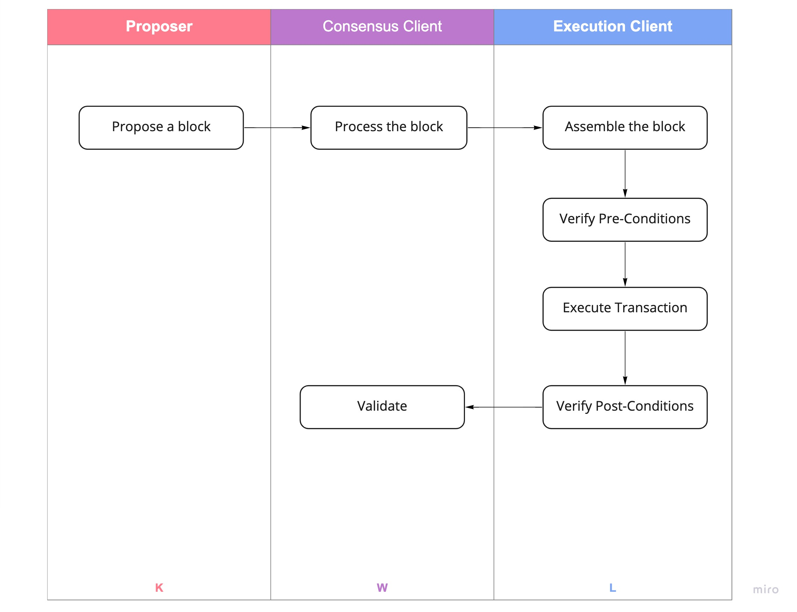
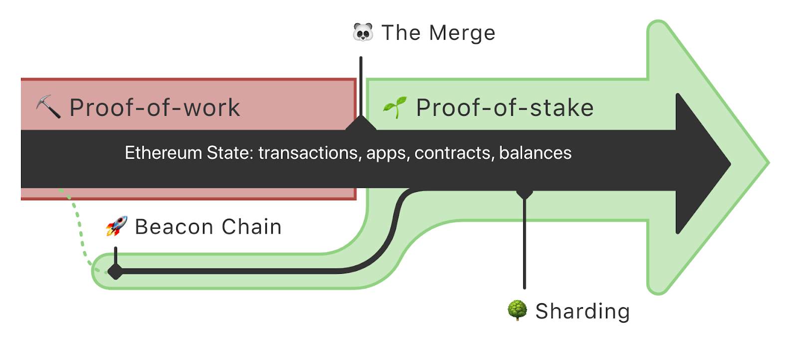

# Important Information You Must Know About The Merge

## Proof of Stake(POS)

The PoS mechanism randomly chooses validators to propose or validate blocks on the [Beacon Chain](https://ethereum.org/en/upgrades/beacon-chain/) in defined time frames.

Proposers are responsible for proposing new consensus blocks, and non-proposing validators are responsible for validating (attesting to) proposed blocks. Validators are rewarded for proposing and attesting to consensus blocks eventually included in the Beacon Chain, and penalized for malicious behavior. Validators also receive [transaction fees](https://docs.teku.consensys.net/en/latest/HowTo/Prepare-for-The-Merge/#configure-the-fee-recipient) for included blocks.

Each consensus block contains an execution payload, which contains a list of transactions and other data required to execute and validate the payload.

When a node validates a consensus block, its [consensus client](https://docs.teku.consensys.net/en/latest/Concepts/Merge/#execution-and-consensus-clients) processes the block and sends the execution payload to the [execution client](https://docs.teku.consensys.net/en/latest/Concepts/Merge/#execution-and-consensus-clients), which:

1. Assembles a block on the execution layer.
2. Verifies pre-conditions.
3. Executes transactions.
4. Verifies post-conditions.
5. Sends the validity result back to the consensus client.

If the block is valid, the execution client includes it in the execution chain and stores the new state in execution state storage.

If a consensus block receives attestations backed by enough staked ETH, the block is included in the Beacon Chain.

## Beacon Chain

Beacon Chain is running in parallel with the mainet of Ethereum.

Think of the Beacon Chain as a light house. In the Beacon Chain, the proof-of-stake(POS) has been adopted as the concensus mechanism. 

## Before The Merge - Difficulty Bomb

The difficulty bomb will be a measure to disincentivize Ether ([ETH](https://cointelegraph.com/ethereum-price)) mining operations from keeping their physical mining devices running as the network transitions from proof-of-work (PoW) to [proof-of-stake](https://cointelegraph.com/blockchain-for-beginners/proof-of-stake-vs-proof-of-work:-differences-explained) (PoS).

We’ve had some important events happening on Ethereum recently, but first a comment on the pressure being put on blocktimes due to the difficulty bomb. On May 27, developers decided not to postpone the difficulty bomb at their biweekly core developers’ meeting, so it’s going ahead as planned. Recall that the Arrow Glacier fork implemented [EIP-4345](https://eips.ethereum.org/EIPS/eip-4345) in November 2021, which makes the difficulty bomb “noticeable in June 2022." 

Blocktimes on the Ethereum mainnet have gone from averaging 13.3 seconds in April to ~13.9s over the last week. According to [Ethereum community researchers](https://ethresear.ch/t/blocks-per-week-as-an-indicator-of-the-difficulty-bomb/12120/28), these blocktimes are predicted to go up to ~16s by the second full week of June then above ~18s by the second full week of July. In our view, things could start to get painful for network users at the beginning of August when blocktimes could get above 21s then 25s by the end of that month. [Optimistic projections](https://decrypt.co/100915/ethereum-merge-coming-august-everything-plan-core-dev) from core developer Preston Van Loon suggest that the merge (the transition of the mainnet to a proof-of-stake consensus mechanism) could take place in August.

## Before The Merge - Arror Glacier Upgrade

https://twitter.com/TimBeiko/status/1535335515750166528?s=20&t=ZBDl_PlafbV3hq2V2NKsZA

The [Ethereum](https://academy.binance.com/en/articles/what-is-ethereum) Arrow Glacier Upgrade is a fairly simple update implemented in block number 13,773,000, Dec 9, 2021. Arrow Glacier delays the network's difficulty bomb, allowing developers more time to prepare [Ethereum 2.0](https://academy.binance.com/en/articles/what-is-ethereum-2-0-and-why-does-it-matter). Extending the time bomb is a regular aspect of Ethereum updates. It was previously scheduled for December 2021 with the [London hard fork](https://academy.binance.com/en/articles/what-is-the-ethereum-london-hard-fork), but is now expected to occur around June 2022.

We had an incident because of this upgrade!!! 

## After The Merge - Goerlin and Sepolia

Developers should migrate their test work to Goerlin and Sepolia ASAP. At this moment, Goerlin is going to be supported by NodeReal.

- Ethereum core developers have confirmed that only Goerli and Sepolia Testnets will be maintained after the Merge.
- The Kiln, Rinkeby, and Ropsten testnets will slowly be retired.
- Ethereum developers are urged to shift to Goerli and Sepolia.
- The Goerli testnet’s state is the closest to the Ethereum mainnet.
- Sepolia is relatively new with a short history allowing it to sync faster and run nodes using less storage.

## After The Merge - Sharding

Sharding is not a new concept in computer science. The target of sharding is to increase the scalability by splitting data . Eventually, you can run a node on your laptop, even on a phone.

- Sharding is a multi-phase upgrade to improve Ethereum’s scalability and capacity.
- Sharding provides secure distribution of data storage requirements, enabling rollups to be even cheaper, and making nodes easier to operate.
- They enable layer 2 solutions to offer low transaction fees while leveraging the security of Ethereum.
- This upgrade is planned to follow The Merge of Mainnet with the Beacon Chain.

Want to know more? 

https://members.delphidigital.io/reports/the-hitchhikers-guide-to-ethereum

