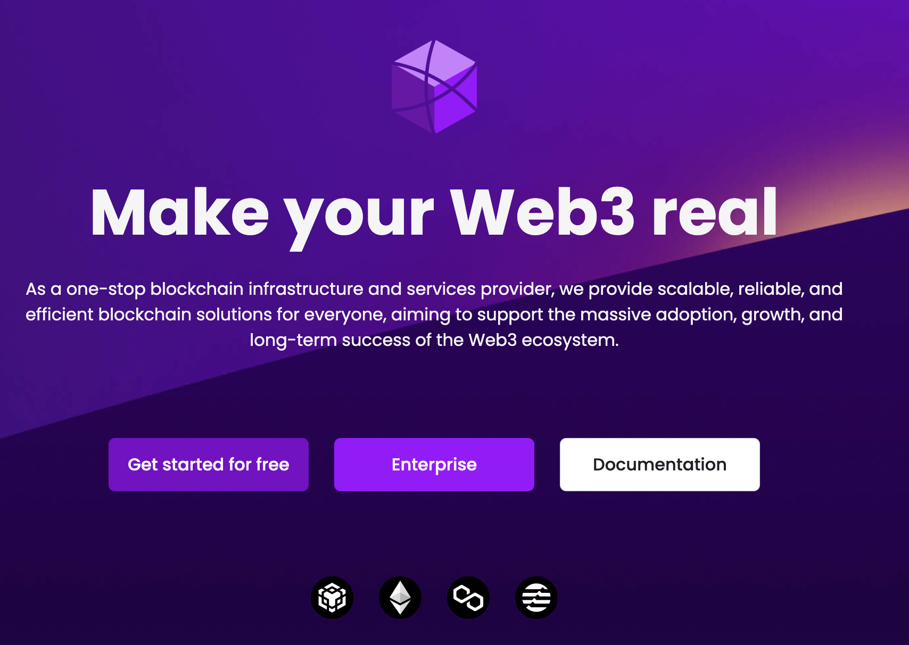
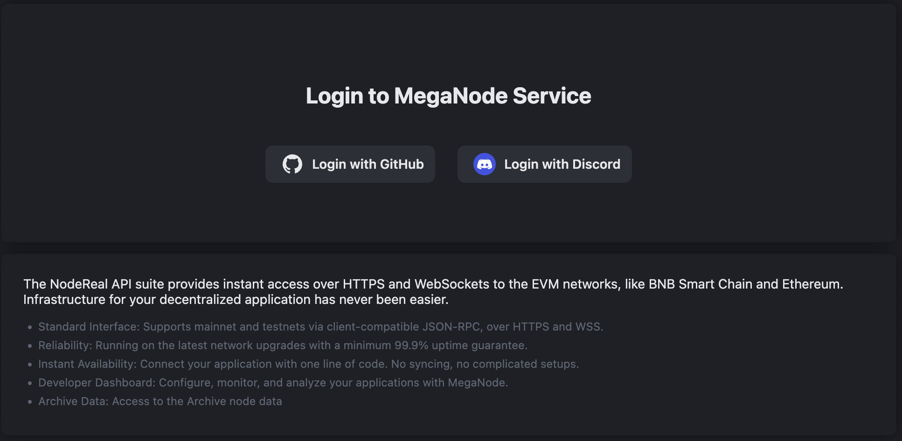
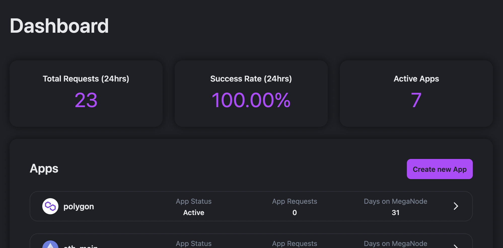
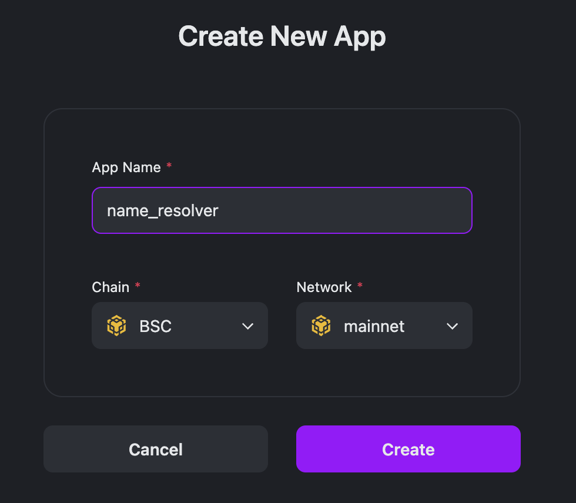
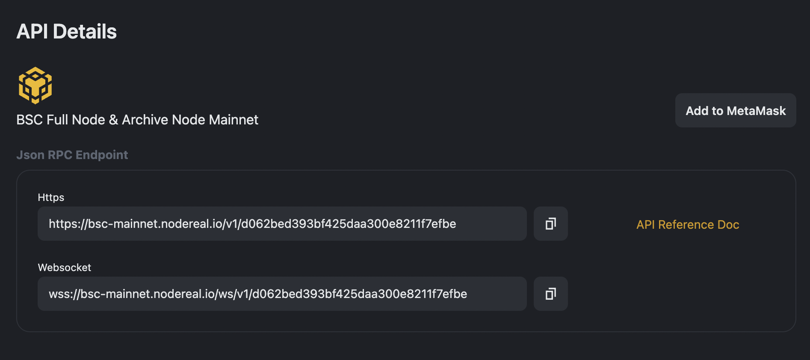

# How to resolve a name through SpaceID SDK

## Overview

SpaceID aims to provide an universal identifier, working across all chains. 

Today, you have multiple identities and multiple usernames across many different applications and blockchains. You have your legal name, email address, Twitter handle, a BNB Chain and Solana address, etc.

Universal identification of resources can help dApps achieve much better interoperability and flexibility. The SPACE ID (SID) will be more than just a name, it is also your multi-chain identity in the metaverse: trade cryptos, lend tokens, mint NFTs, and buy tickets or even homes in the future highly decentralized world easier by using only one ID.


## Installation and Configuration

Install @siddomains/sidjs, alongside [web3](https://www.npmjs.com/package/web3).

```shell
npm install @siddomains/sidjs web3
```

Login to [NodeReal](www.nodereal.io) and click the *Get Started for free* . 



Click *Login with Github* button to login.



Click *Create new App* button to create a new dApp. 



Choose a name for your app and select the network. For example, I am choosing the BSC mainnet to resolve the name of *resolver.bnb*.



In your newly created app, you will find your RCP service API URL. 



Now, it is time to start coding. First, create a resolve scripts named resolver.js like below. *You need replace the nodereal URL to your own API endpoint.* 

```typescript
const SID = require('@siddomains/sidjs').default      
const SIDfunctions = require('@siddomains/sidjs')                                                                                                                                                                                
const Web3 = require('web3')                                                                                                                

let sid 

async function main(name) {
  const nodereal = "https://bsc-mainnet.nodereal.io/v1/{YOUR API KEY}"  
  const provider = new Web3.providers.HttpProvider(nodereal)
  sid = new SID({ provider, sidAddress: SIDfunctions.getSidAddress('56') })

  const address = await sid.name(name).getAddress() // 0x123                                                                                
  console.log("name: %s, address: %s", name, address)                                                                                          

}                                                                                                                                           
main("resolver.bnb")

```

Execute the scripts in your terminal 

```shell
node resolver.js
(node:80864) ExperimentalWarning: The Fetch API is an experimental feature. This feature could change at any time
(Use `node --trace-warnings ...` to show where the warning was created)
name: resolver.bnb, address: 0x38CDc905717b9dD48A658A4943C456E83091B64d
```

## Code Explaination

Firstly, we need create a chain API endpoint const. As we have created the endpoint through nodereal API service, we can just replace the URL with our own app endpoint.

```typescript
const nodereal = "https://bsc-mainnet.nodereal.io/v1/{YOUR API KEY}"  
```

Then, we created a web3 HTTP provider with nodereal endpoint. It is the connection with our BSC chain. 

```typescript
const provider = new Web3.providers.HttpProvider(nodereal)
```

We created an SpaceID object with SID class, which SID chain id was set to "56", which is the BSC mainnet.

```typescript
sid = new SID({ provider, sidAddress: SIDfunctions.getSidAddress('56') })
```

Finally we called the get address for the name passed to the async function of main, in our case, it is "resolver.bnb".

```typescript
const address = await sid.name(name).getAddress() // 0x123    
```


## References

nodereal https://www.nodereal.io

spaceid github repository https://github.com/Space-ID/sidjs
