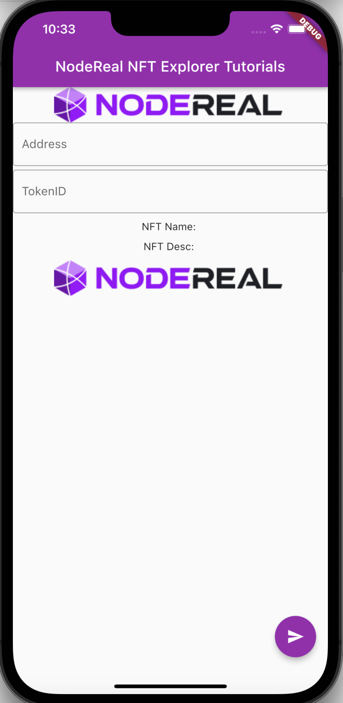
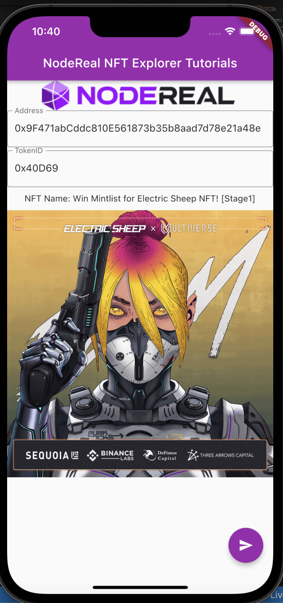

# Build your mobile NFT explorer with flutter

The NFT is getting its momentum, and as a develper, you must be very curious how to  build NFT application from scratch. Through this tutorial, you will be able to build your first NFT application for your iPhone from scratch. I will guide you through the journey to build our NFT application with the popular cross-platform framework flutter and NodeReal NFT API. We want to write once, adopt everywhere!

Being blocked to follow up? Follow our twitter and discord to ask any questions you like!

## Getting Started

This project is a starting point for your web3 journey! You will be able to learn the following topics.

1. What is flutter and why it is popular for developers
2. Why you need a NFT API
3. How to use NFT APIs to build your applications.

A few resources to get you started if this is your first Flutter project:

- [NodeReal NFT APIs](https://docs.nodereal.io/nodereal/meganode/api-docs/enhanced-api/nft-api)
- [Lab: Write your first Flutter app](https://docs.flutter.dev/get-started/codelab)
- [Cookbook: Useful Flutter samples](https://docs.flutter.dev/cookbook)

## Setup Your Environment

I assume you are using macbook like myself, the first thing you need to do is to install your flutter. 

If you are running a mac with Apple Silicon, the rosetta is a must. 

```shell
sudo softwareupdate --install-rosetta --agree-to-license
```

Download the binary from [link](https://storage.googleapis.com/flutter_infra_release/releases/stable/macos/flutter_macos_arm64_3.3.1-stable.zip), and extract the file in the desired location, for example:

```shell
cd ~/development
unzip ~/Downloads/flutter_macos_3.3.1-stable.zip
```

Add the `flutter` tool to your path:

```shell
export PATH="$PATH:`pwd`/flutter/bin"
```

Install XCode from your AppStore. Configure the Xcode command-line tools to use the newly-installed version of Xcode by running the following from the command line:

```shell
sudo xcode-select --switch /Applications/Xcode.app/Contents/Developer
sudo xcodebuild -runFirstLaunch
```

Make sure the Xcode license agreement is signed by either opening Xcode once and confirming or running `sudo xcodebuild -license` from the command line.

## Clone the project

You can clone the project from repo below.

```shell
gh repo clone node-real/community_kb
```


## Build the project

Go to the diretory of */community_kb/web3/03_build_the_open_web_together/nft_explorer_01*, and execute command below.

```shell
#open iphone simulator
open -a Simulator
#run your project 
flutter run
```

You will see the applicaiton is running on your iphone simulator.



Enter the address of the contract, and the token id, the application will be like below.  I am using the project [Galxe Galaxy OAT](https://galxe.com/bnbchain/campaign/GCnwqUUCbn) as an example. 



## Start Coding

This is a flutter project that targets to be executable on web, Android and iOS. After you bootstraps your flutter project, a couple of things need to be done. 

1. Install the JSONPRC client for dart
2. Build your layout of UI
3. Query the NFT metadata 
4. Display the NFT image

We need install jsonrpc2 to your environment. It is very straightforard. You can execute the command below.

```shell
flutter pub add jsonrpc2
```

And then include the following packages into your code under *lib/main.dart*.

```dart
import 'package:http/http.dart' as http;
import 'package:jsonrpc2/jsonrpc2.dart';
```

Then it is time to build your layout of UI. 

Our tutorial, to simplify, we make a very simple UI by adding widgets, it is very similar to the [react](https://reactjs.org/). We just create a *scaffold*, and this *scaffold*, we can add *appBar* on the top to display the title. and then we add a body with *container*, in this *container*, a *column* is created to have two *TextField*. These two *TextField* are used to allow users to enter the smart contract address and token id. 

Behind the *body*, a button is added to send the information to the NFT API to query the data by trigger the function of *_retrieveNFTMetadata*.

Below the UI layout code snippet.

```dart
@override
  Widget build(BuildContext context) {
    // This method is rerun every time setState is called.
    // The Flutter framework has been optimized to make rerunning build methods
    // fast, so that you can just rebuild anything that needs updating rather
    // than having to individually change instances of widgets.
    return Scaffold(
      appBar: AppBar(
        // Here we take the value from the MyHomePage object that was created by
        // the App.build method, and use it to set our appbar title.
        title: Text(widget.title),
      ),
      body: Container(
        child: Column(
          children: [
            Image(
              image: NetworkImage('https://www.nodereal.io/static/nodereal/images/home/logo-nodereal.png'),
            ),
            TextField(
              decoration: new InputDecoration(
                border: new OutlineInputBorder(
                  borderSide: new BorderSide(color: Colors.teal)
                  ),
                  hintText: 'Your NFT Contract Address',
                  labelText: 'Address'
              ),
              controller: nftAddController,
            ),
            SizedBox(height: 5),
            TextField(
              decoration: new InputDecoration(
                border: new OutlineInputBorder(
                  borderSide: new BorderSide(color: Colors.teal)
                  ),
                  hintText: 'NFT TokenID 0x:',
                  labelText: 'TokenID'
              ),
              controller: nftTokenIDController,
            ),
            SizedBox(height: 10),
            Text("NFT Name: " + _name),
            SizedBox(height: 10),
            Image(
              image: NetworkImage(_image),
            ),
            
          ],
        ),
      ),
      floatingActionButton: FloatingActionButton(
        onPressed: _retrieveNFTMetadata,
        tooltip: 'Query',
        child: const Icon(Icons.send),
      ), // This trailing comma makes auto-formatting nicer for build methods.
    );
  }
```

Next, let`s build our function of *_retrieveNFTMetaData* function, it is a function to call the JSONRPC2 library to query the NodeReal NFT API.

This is the code snippet of JSONRPC2 library implementation. You need create two classes, which are *HttpServerProxy* and *HttpBatchServerProxy*, which implements the individual JSONRPC calls or batch calls. 

```dart
class HttpServerProxy extends ServerProxyBase {
  /// customHeaders, for jwts and other niceties
  Map<String, String> customHeaders;

  /// constructor. superize properly
  HttpServerProxy(url, [this.customHeaders = const <String, String>{}])
      : super(url);

  /// Return a Future with the JSON-RPC response
  @override
  Future<String> transmit(String package) async {
    /// This is HttpRequest from dart:html
    var headers = {'Content-Type': 'application/json; charset=UTF-8'};
    if (customHeaders.isNotEmpty) {
      headers.addAll(customHeaders);
    }

    // useful for debugging!
    // print(package);
    var resp =
        await http.post(Uri.parse(resource), body: package, headers: headers);

    var body = resp.body;
    if (resp.statusCode == 204 || body.isEmpty) {
      return ''; // we'll return an empty string for null response
    } else {
      return body;
    }
  }

}

/// see the documentation in [BatchServerProxyBase]
class HttpBatchServerProxy extends BatchServerProxyBase {
  @override
  dynamic proxy;

  /// constructor
  HttpBatchServerProxy(String url, [customHeaders = const <String, String>{}]) {
    proxy = HttpServerProxy(url, customHeaders);
  }
}
```

Then you can create an object to make request to *NodeReal NFT APIs*, do NOT forget to refresh the main page to display your NFT image. 

```dart
Future<dynamic> _loadNFTMeta() async{
      String _url = "https://bsc-mainnet.nodereal.io/v1/{YOUR API KEY}";
      HttpServerProxy _proxy = HttpServerProxy(_url);
      var _response =  await _proxy.call("nr_getNFTMeta", [_nft_address, _nft_tokenid,"ERC721"]);;
      return _response;
  }

  void _retrieveNFTMetadata() {
    _nft_address = nftAddController.text;
    _nft_tokenid = nftTokenIDController.text;
    _loadNFTMeta().then((result) => {
        _image = (json.decode(result["meta"]))["image"],
        _name = (json.decode(result["meta"]))["name"],
        _desc = (json.decode(result["meta"]))["description"],
        _refresh(_image, _name, _desc),      
    });

  }
```

Yeah, that is it, is it simple? As we are using the NFT API from NodeReal, it is very easy to build an NFT application, you do not need to worry about the backend service, you can only focus on your front end code, and hand over all backend stuff to *NodeReal NFT APIs*!


