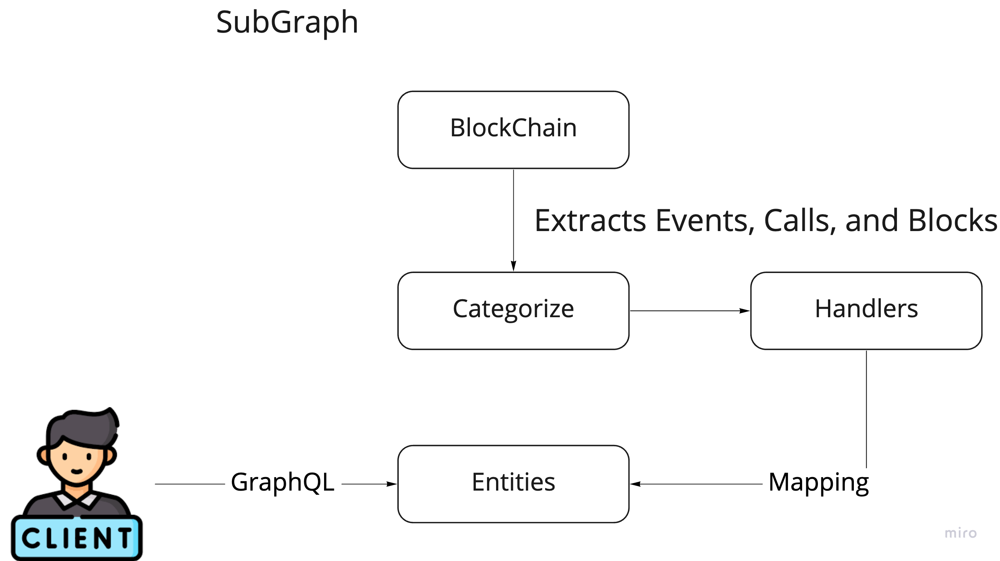
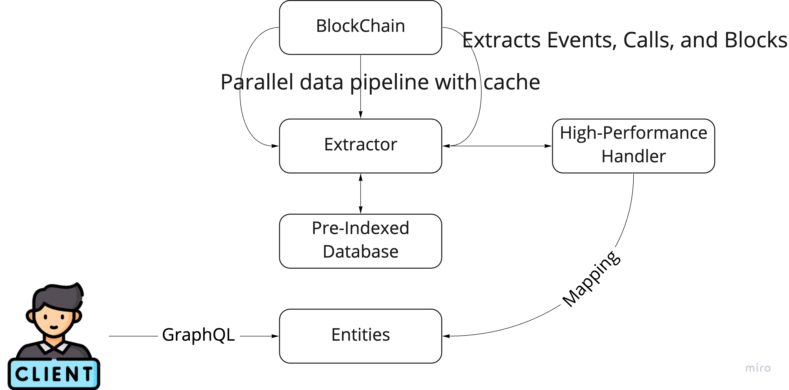

## Defi Data API Intro

### How Subgraph Works

A subgraph extracts data from a blockchain, processing it and storing it so that it can be easily queried via GraphQL.

The subgraph definition consists of a few files:

- `subgraph.yaml`: a YAML file containing the subgraph manifest
- `schema.graphql`: a GraphQL schema that defines what data is stored for your subgraph, and how to query it via GraphQL
- `AssemblyScript Mappings`: [AssemblyScript](https://github.com/AssemblyScript/assemblyscript) code that translates from the event data to the entities defined in your schema

### How It Works

**Basically, we rewrote our client's SubGraph into Golang code, and connect the code with our pre-indexed Blocks and States data.**

1. Translate the SubGraph into Golang code (Parser)
2. We categorise the Events in the SubGraph (Normally the SubGraph will map Events to Handlers, that's how SubGraph works)
3. As we have pre-indexed the Blocks and States data, we can efficiently retrieve the data and send it to the handlers
4. The Data Pipeline is fine tuned to minimise the IO wait time of the handlers so the events can be processed very efficiently
5. Finally the processed data was stored into our data source

### Why We Are Faster 

1. We fine tuned the Data Pipeline to minimise the IO wait time, which usually could take 60%~90% of the process time
2. Our Data Pipeline is Event based, which can be way more efficient than Block based mechanism, which is used by GraphNode.
3. Our Data is cached in high speed data source in case historical data is required, this avoids frequent database visits which could be quite time consuming

